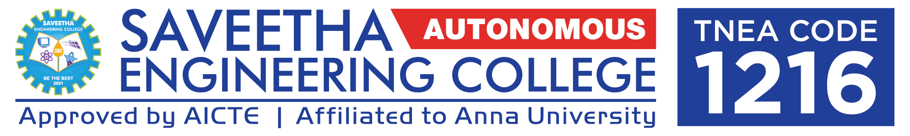
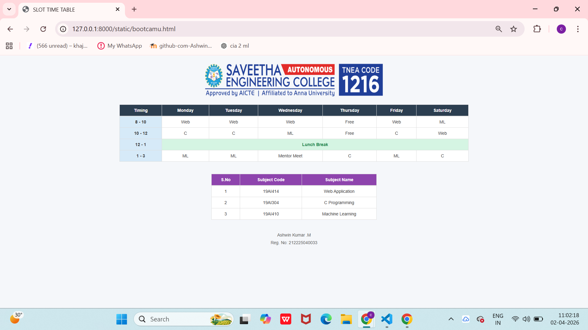

# Ex08 CAMU Schedule using Bootstrap
## Date: 30/03/26

## AIM:
To design a responsive and visually appealing CAMU Schedule using Bootstrap.

## DESIGN STEPS:

### Step 1:
Clone the repository from GitHub.

### Step 2:
Create Django Admin project.

### Step 3:
Create a New App under the Django Admin project.

### Step 4:
Add the Bootstrap CDN link inside the ```<head>``` section.

### Step 5:
Insert a table element with Bootstrap table classes.

### Step 6:
Construct the complete table.

### Step 7:
Add a header/footer displaying copyright information.

### Step 8:
Publish the website in the LocalHost.

## PROGRAM :
```
<!DOCTYPE html>
<html>
<head>
    <title>SLOT TIME TABLE</title>

    <link rel="stylesheet" href="https://maxcdn.bootstrapcdn.com/bootstrap/3.4.1/css/bootstrap.min.css">

    <style>
        body {
            background-color: #f5f7fa;
        }

        .header-img {
            display: block;
            margin: 20px auto;
        }

        .main-table th {
            background-color: #2c3e50;
            color: white;
            text-align: center;
        }

        .time-col {
            background-color: #d6eaf8;
            font-weight: bold;
            text-align: center;
        }

        .lunch {
            background-color: #d5f5e3;
            text-align: center;
            font-weight: bold;
            color: #1e8449;
        }

        .sub-table th {
            background-color: #8e44ad;
            color: white;
            text-align: center;
        }

        td {
            text-align: center;
            background-color: white;
        }

        .main-table {
            background-color: white;
        }
    </style>
</head>

<body>



<div class="container">

    <div class="table-responsive">
        <table class="table table-bordered main-table">

            <thead>
                <tr>
                    <th>Timing</th>
                    <th>Monday</th>
                    <th>Tuesday</th>
                    <th>Wednesday</th>
                    <th>Thursday</th>
                    <th>Friday</th>
                    <th>Saturday</th>
                </tr>
            </thead>

            <tbody>
                <tr>
                    <td class="time-col">8 - 10</td>
                    <td>Web</td>
                    <td>Web</td>
                    <td>Web</td>
                    <td>Free</td>
                    <td>Web</td>
                    <td>ML</td>
                </tr>

                <tr>
                    <td class="time-col">10 - 12</td>
                    <td>C</td>
                    <td>C</td>
                    <td>ML</td>
                    <td>Free</td>
                    <td>C</td>
                    <td>Web</td>
                </tr>

                <tr>
                    <td class="time-col">12 - 1</td>
                    <td colspan="6" class="lunch">Lunch Break</td>
                </tr>

                <tr>
                    <td class="time-col">1 - 3</td>
                    <td>ML</td>
                    <td>ML</td>
                    <td>Mentor Meet</td>
                    <td>C</td>
                    <td>ML</td>
                    <td>C</td>
                </tr>
            </tbody>

        </table>
    </div>

    <br>

    <div class="table-responsive col-md-6 col-md-offset-3">
        <table class="table table-bordered sub-table">

            <thead>
                <tr>
                    <th>S.No</th>
                    <th>Subject Code</th>
                    <th>Subject Name</th>
                </tr>
            </thead>

            <tbody>
                <tr>
                    <td>1</td>
                    <td>19AI414</td>
                    <td>Web Application</td>
                </tr>

                <tr>
                    <td>2</td>
                    <td>19AI304</td>
                    <td>C Programming</td>
                </tr>

                <tr>
                    <td>3</td>
                    <td>19AI410</td>
                    <td>Machine Learning</td>
                </tr>
            </tbody>

        </table>
    </div>

</div>

<footer class="text-center" style="margin-top: 20px; color: #555;">
    <p style="margin-bottom: 0;">Ashwin Kumar .M</p>
    <p style="margin-top: 5px;">Reg. No: 212225040033</p>
</footer>

<script src="https://ajax.googleapis.com/ajax/libs/jquery/3.7.1/jquery.min.js"></script>
<script src="https://maxcdn.bootstrapcdn.com/bootstrap/3.4.1/js/bootstrap.min.js"></script>

</body>
</html>

```

## OUTPUT:



## RESULT:
A responsive and visually appealing CAMU Schedule web page using Bootstrap is designed successfully.
